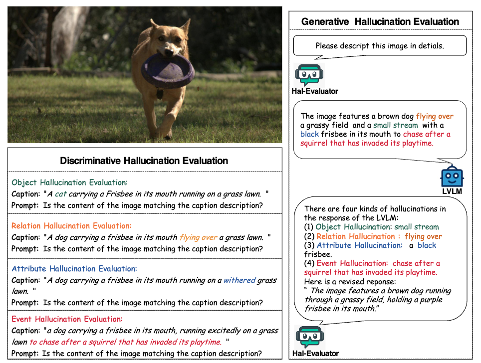
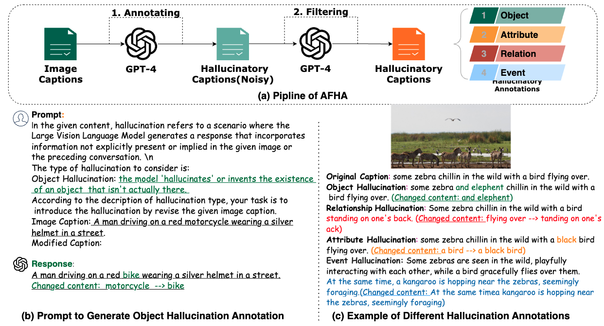

# Hal-Eval: A Universal and Fine-grained Hallucination Evaluation Framework for Large Vision Language Models

<!-- <style>
  tr {
    border-bottom: 1px solid black;
  }
</style> -->

<p align="center">
  🤗 <a href="https://huggingface.co/WisdomShell" target="_blank">Hugging Face</a>  • 🌐 <a href="http://se.pku.edu.cn/kcl/" target="_blank">PKU-KCL</a> •  🤖  <a href="http://27.188.73.160:7102/" target="_blank">Demo: Hal-Evaluator</a> • <body>
    &#9749 
</body> <a href="https://arxiv.org/abs/2402.15721" target="_blank">Paper</a> 
 
</p>

Please refer to our preprint paper: 
[**Hal-Eval: A Universal and Fine-grained Hallucination Evaluation Framework for Large Vision Language Models.**](https://arxiv.org/abs/2402.15721) 
## Introduction

<p align="center">
    
<p>

Large Vision-Language Models (LVLMs) exhibit remarkable capabilities but struggle with "hallucinations"—inconsistencies between images and their descriptions. Previous hallucination evaluation studies on LVLMs have identified hallucinations in terms of objects, attributes, and relations but overlooked complex hallucinations that create an entire narrative around a fictional entity. In this work, We introduce a refined taxonomy of hallucinations, featuring a new category: Event Hallucination. 
We then utilize advanced LLMs to generate and filter fine-grained hallucinatory data consisting of various types of hallucinations, with a particular focus on event hallucinations, laying the groundwork for integrating discriminative and generative evaluation methods within our universal evaluation framework **Hal-Eval**. The proposed benchmark distinctively assesses LVLMs' ability to tackle a broad spectrum of hallucinations, making it a reliable and comprehensive tool for gauging LVLMs' efficacy in handling hallucinations. 

### Compared with Other Hallucination Benchmark

<p align="center">
<table>
  <tr>
    <th>Benchmark</th>
    <th colspan="2">Tasks</th>
    <th colspan="4">Discriminative Hallucination</th>
    <th colspan="4">Generative Hallucination</th>
  </tr>
  <tr>
    <th></th>
    <th>Dis</th>
    <th>Gen</th>
    <th>Object</th>
    <th>Attribute</th>
    <th>Relation</th>
    <th>Event</th>
    <th>Object</th>
    <th>Attribute</th>
    <th>Relation</th>
    <th>Event</th>
  </tr>
 <tr>
    <td>POPE</td>
    <td class="green">✔️</td>
    <td>❌</td>
    <td class="green">✔️</td>
    <td>❌</td>
    <td>❌</td>
    <td>❌</td>
    <td>❌</td>
    <td>❌</td>
    <td>❌</td>
    <td>❌</td>
  </tr>
  <tr>
    <td>NOPE</td>
    <td class="green">✔️</td>
    <td>❌</td>
    <td class="green">✔️</td>
    <td>❌</td>
    <td>❌</td>
    <td>❌</td>
    <td>❌</td>
    <td>❌</td>
    <td>❌</td>
    <td>❌</td>
  </tr>
  <tr>
    <td>CIEM</td>
    <td class="green">✔️</td>
    <td>❌</td>
    <td class="green">✔️</td>
    <td>❌</td>
    <td>❌</td>
    <td>❌</td>
    <td>❌</td>
    <td>❌</td>
    <td>❌</td>
    <td>❌</td>
  </tr>
    <tr>
    <td>M-HalDetect</td>
     <td>❌</td>
    <td class="green">✔️</td>
    <td>❌</td>
    <td>❌</td>
    <td>❌</td>
    <td>❌</td>
    <td class="green">✔️</td>
    <td class="green">✔️</td>
    <td class="green">✔️</td>
    <td>❌</td>
  </tr>
    <tr>
    <td>GAVIE</td>
    <td>❌</td>
    <td class="green">✔️</td>
    <td>❌</td>
    <td>❌</td>
    <td>❌</td>
    <td>❌</td>
    <td class="green">✔️</td>
    <td class="green">✔️</td>
    <td>❌</td>
    <td>❌</td>
  </tr>
    <tr>
    <td>FAITHScore</td>
        <td>❌</td>
    <td class="green">✔️</td>
    <td>❌</td>
    <td>❌</td>
    <td>❌</td>
    <td>❌</td>
    <td class="green">✔️</td>
    <td class="green">✔️</td>
    <td class="green">✔️</td>
    <td>❌</td>
  </tr>
    <tr>
    <td>MMhal-Bench</td>
        <td>❌</td>
    <td class="green">✔️</td>
    <td>❌</td>
    <td>❌</td>
    <td>❌</td>
    <td>-</td>
    <td>-</td>
    <td>-</td>
    <td>-</td>
    <td>❌</td>
  </tr>
       <tr>
    <td>HaELM</td>
        <td>❌</td>
    <td class="green">✔️</td>
    <td>❌</td>
    <td>❌</td>
    <td>❌</td>
    <td>-</td>
    <td>-</td>
    <td>-</td>
    <td>-</td>
    <td>❌</td>
  </tr>
    <tr>
    <td>AMBER</td>
    <td class="green">✔️</td>
    <td class="green">✔️</td>
    <td class="green">✔️</td>
    <td class="green">✔️</td>
     <td class="green">✔️</td>
    <td>❌</td>
     <td class="green">✔️</td>
    <td>❌</td>
    <td>❌</td>
    <td>❌</td>
  </tr>
      <tr>
    <td> <b>Hal-Eval</b> </td>
    <td class="green">✔️</td>
    <td class="green">✔️</td>
    <td class="green">✔️</td>
    <td class="green">✔️</td>
     <td class="green">✔️</td>
     <td class="green">✔️</td>
     <td class="green">✔️</td>
    <td class="green">✔️</td>
     <td class="green">✔️</td>
     <td class="green">✔️</td>
  </tr>
  <!-- Add more rows as needed -->
</table>
</p>


## AFHA: Automatic Fine-grained Hallucination Annotation Pipline

<p align="center">
    
<p>

The existing multimodal hallucination research suffers from a lack of large-scale datasets with fine-grained annotations specific to hallucinations. To address this issue, we design AFHA, an Automatic Fine-grained Hallucination Annotation pipline featuring annotations for four hallucination types and specific hallucination content. For more details, please refer to our paper [paper](https://arxiv.org/abs/2402.15721)


## Evaluation

Hal-Eval is divided into two distinct segments: Discriminative Evaluation and Generative Evaluation. We have opted to assess five widely utilized open-source LVLMs: [MiniGPT-4](https://github.com/Vision-CAIR/MiniGPT-4) , [InstructBLIP](https://github.com/salesforce/LAVIS/tree/main/projects/instructblip) , [mPLUG-owl](https://github.com/X-PLUG/mPLUG-Owl), [LLaVA](https://github.com/haotian-liu/LLaVA), [LLaVA1.5](https://github.com/haotian-liu/LLaVA). 


## Discriminative Evalutation

### Evaluation Dataset
Our evaluation dataset is split into two parts. One part consists of in-domain evaluation data, composed of image-text pairs from COCO 2014 validation and COCO 2017 test sets. The other part is sourced from web-based datasets such as CC, SBU  , and LAION, providing out-of-domain data sampled randomly.  We provide the evaluation [data](./evaluation_dataset/).

### Evaluation Script
Please set the parameters in the [5k_code.py](./evaluation/discriminative_evaluation/5k_code.py) and run the following command in terminal:

```Shell
CUDA_VISIBLE_DEVICES=0 python 5k_code.py
```


### Evaluation Results
<p align="center">
<table>
  <thead>
    <tr>
      <th>Dataset</th>
      <th>Type</th>
      <th>Model</th>
      <th>Accuracy</th>
      <th>Precision</th>
      <th>Recall</th>
      <th>F1</th>
      <th>Yes (%)</th>
    </tr>
  </thead>
  <tbody>
  <tr>
    <td rowspan="20">In-domain</td>
    <td rowspan="6"><i>Object</i></td>
    <td>mPLUG-Owl</td>
    <td>49.8</td>
    <td>49.8</td>
    <td>44.7</td>
    <td>47.1</td>
    <td>44.1</td>
  </tr>
  <tr>
    <td>LLaVA</td>
    <td>52.6</td>
    <td>55.5</td>
    <td>26.3</td>
    <td>35.7</td>
    <td>23.6</td>
  </tr>
  <tr>
    <td>MiniGPT-4</td>
    <td>50.4</td>
    <td>50.3</td>
    <td>46.5</td>
    <td>48.3</td>
    <td>40.2</td>
  </tr>
  <tr>
    <td>InstructBLIP</td>
    <td>50.0</td>
    <td>50.0</td>
    <td>99.0</td>
    <td>66.5</td>
    <td>98.0</td>
  </tr>
  <tr>
    <td>LLaVA 1.5</td>
    <td>62.2</td>
    <td>76.1</td>
    <td>35.6</td>
    <td>48.5</td>
    <td>23.3</td>
  </tr>
  </tbody>
   <tbody>
  <tr>
    <td rowspan="20">In-domain</td>
    <td rowspan="7"><i>Attribute</i></td>
    <td>mPLUG-Owl</td>
    <td>49.9</td>
    <td>49.9</td>
    <td>44.7</td>
    <td>47.2</td>
    <td>44.6</td>
  </tr>
  <tr>
    <td>LLaVA</td>
    <td>52.8</td>
    <td>55.9</td>
    <td>26.3</td>
    <td>35.8</td>
    <td>23.5</td>
  </tr>
  <tr>
    <td>MiniGPT-4</td>
    <td>51.1</td>
    <td>51.1</td>
    <td>46.5</td>
    <td>48.7</td>
    <td>39.4</td>
  </tr>
  <tr>
    <td>InstructBLIP</td>
    <td>49.8</td>
    <td>49.8</td>
    <td>99.0</td>
    <td>66.3</td>
    <td>98.1</td>
  </tr>
  <tr>
    <td>LLaVA 1.5</td>
    <td>62.2</td>
    <td>76.1</td>
    <td>35.6</td>
    <td>48.5</td>
    <td>23.3</td>
  </tr>
</tbody>
<tbody>
  <tr>
   <td rowspan="20">In-domain</td>
    <td rowspan="5"><i>Relation</i></td>
    <td>mPLUG-Owl</td>
    <td>50.4</td>
    <td>50.5</td>
    <td>44.7</td>
    <td>47.4</td>
    <td>44.7</td>
  </tr>
  <tr>
    <td>LLaVA</td>
    <td>52.7</td>
    <td>55.7</td>
    <td>26.3</td>
    <td>35.8</td>
    <td>23.7</td>
  </tr>
  <tr>
    <td>MiniGPT-4</td>
    <td>50.4</td>
    <td>50.1</td>
    <td>46.5</td>
    <td>48.2</td>
    <td>40.0</td>
  </tr>
  <tr>
    <td>InstructBLIP</td>
    <td>49.8</td>
    <td>49.9</td>
    <td>99.0</td>
    <td>66.3</td>
    <td>97.7</td>
  </tr>
  <tr>
    <td>LLaVA 1.5</td>
    <td>55.4</td>
    <td>59.1</td>
    <td>35.6</td>
    <td>44.4</td>
    <td>22.1</td>
  </tr>
</tbody>
<tbody>
  <tr>
   <td rowspan="20">In-domain</td>
    <td rowspan="5"><i>Event</i></td>
    <td>mPLUG-Owl</td>
    <td>49.7</td>
    <td>49.7</td>
    <td>44.6</td>
    <td>47.0</td>
    <td>44.8</td>
  </tr>
  <tr>
    <td>LLaVA</td>
    <td>51.5</td>
    <td>53.0</td>
    <td>26.3</td>
    <td>35.1</td>
    <td>24.8</td>
  </tr>
  <tr>
    <td>MiniGPT-4</td>
    <td>49.6</td>
    <td>50.0</td>
    <td>46.5</td>
    <td>48.2</td>
    <td>40.3</td>
  </tr>
  <tr>
    <td>InstructBLIP</td>
    <td>49.6</td>
    <td>49.7</td>
    <td>99.0</td>
    <td>66.2</td>
    <td>84.3</td>
  </tr>
  <tr>
    <td>LLaVA 1.5</td>
    <td>62.7</td>
    <td>77.9</td>
    <td>35.6</td>
    <td>48.9</td>
    <td>22.8</td>
  </tr>
</tbody>
</table>
<table>
  <thead>
    <tr>
      <th>Dataset</th>
      <th>Type</th>
      <th>Model</th>
      <th>Accuracy</th>
      <th>Precision</th>
      <th>Recall</th>
      <th>F1</th>
      <th>Yes (%)</th>
    </tr>
  </thead>
  <tbody>
    <tr>
      <td rowspan="5">Out-of-domain</td>
      <td rowspan="5"><i>Object</i></td>
      <td>mPLUG-Owl</td>
      <td>50.3</td>
      <td>50.4</td>
      <td>43.6</td>
      <td>46.8</td>
      <td>43.4</td>
    </tr>
    <tr>
      <td>LLaVA</td>
      <td>50.7</td>
      <td>52.7</td>
      <td>9.0</td>
      <td>15.3</td>
      <td>7.2</td>
    </tr>
    <tr>
      <td>MiniGPT-4</td>
      <td>50.3</td>
      <td>51.7</td>
      <td>53.6</td>
      <td>52.6</td>
      <td>25.0</td>
    </tr>
    <tr>
      <td>InstructBLIP</td>
      <td>50.0</td>
      <td>50.0</td>
      <td>100.0</td>
      <td>66.6</td>
      <td>100.0</td>
    </tr>
    <tr>
      <td>LLaVA 1.5</td>
      <td>59.2</td>
      <td>86.2</td>
      <td>21.9</td>
      <td>35.0</td>
      <td>18.2</td>
    </tr>
  </tbody>
  <tbody>
    <tr>
          <td rowspan="5">Out-of-domain</td>
      <td rowspan="5"><i>Attribute</i></td>
      <td>mPLUG-Owl</td>
      <td>50.4</td>
      <td>50.5</td>
      <td>43.6</td>
      <td>46.8</td>
      <td>42.9</td>
    </tr>
    <tr>
      <td>LLaVA</td>
      <td>51.8</td>
      <td>66.5</td>
      <td>9.0</td>
      <td>15.8</td>
      <td>6.2</td>
    </tr>
    <tr>
      <td>MiniGPT-4</td>
      <td>50.0</td>
      <td>51.5</td>
      <td>53.6</td>
      <td>52.6</td>
      <td>24.7</td>
    </tr>
    <tr>
      <td>InstructBLIP</td>
      <td>50.0</td>
      <td>50.0</td>
      <td>100.0</td>
      <td>66.6</td>
      <td>100.0</td>
    </tr>
    <tr>
      <td>LLaVA 1.5</td>
      <td>58.1</td>
      <td>79.4</td>
      <td>21.9</td>
      <td>34.4</td>
      <td>13.8</td>
    </tr>
  </tbody>
  <tbody>
    <tr>
          <td rowspan="5">Out-of-domain</td>
      <td rowspan="5"><i>Relation</i></td>
      <td>mPLUG-Owl</td>
      <td>50.0</td>
      <td>50.0</td>
      <td>43.6</td>
      <td>46.6</td>
      <td>43.1</td>
    </tr>
    <tr>
      <td>LLaVA</td>
      <td>50.8</td>
      <td>57.1</td>
      <td>9.0</td>
      <td>15.5</td>
      <td>7.8</td>
    </tr>
    <tr>
      <td>MiniGPT-4</td>
      <td>49.7</td>
      <td>50.9</td>
      <td>53.6</td>
      <td>52.2</td>
      <td>24.6</td>
    </tr>
    <tr>
      <td>InstructBLIP</td>
      <td>50.0</td>
      <td>50.0</td>
      <td>100</td>
      <td>66.6</td>
      <td>100.0</td>
    </tr>
    <tr>
      <td>LLaVA 1.5</td>
      <td>53.7</td>
      <td>60.2</td>
      <td>21.9</td>
      <td>32.2</td>
      <td>12.7</td>
    </tr>
  </tbody>
  <tbody>
    <tr>
          <td rowspan="5">Out-of-domain</td>
      <td rowspan="5"><i>Event</i></td>
      <td>mPLUG-Owl</td>
      <td>50.1</td>
      <td>50.1</td>
      <td>43.6</td>
      <td>46.6</td>
      <td>43.3</td>
    </tr>
    <tr>
      <td>LLaVA</td>
      <td>46.2</td>
      <td>31.2</td>
      <td>9.0</td>
      <td>14.0</td>
      <td>13.2</td>
    </tr>
    <tr>
      <td>MiniGPT-4</td>
      <td>49.3</td>
      <td>52.3</td>
      <td>53.6</td>
      <td>53.0</td>
      <td>24.3</td>
    </tr>
    <tr>
      <td>InstructBLIP</td>
      <td>50.0</td>
      <td>50.0</td>
      <td>100</td>
      <td>66.6</td>
      <td>99.9</td>
    </tr>
    <tr>
      <td>LLaVA 1.5</td>
      <td>57.7</td>
      <td>77.2</td>
      <td>21.9</td>
      <td>34.2</td>
      <td>14.2</td>
    </tr>
  </tbody>
</table>

   
</table>
</p>

## Generative Evaluation

Regarding generative evaluation, current evaluation methods either rely on proprietary models that require subscription fees, such as GPT-4, or depend on fine-tuned large language models (LLMs) that necessitate additional ground truth annotations—a process that is prohibitively expensive. This significantly restricts the scalability of evaluating models. In response, we propose **Hal-Evaluator**, a reference-free, open-source evaluation model designed specifically to detect hallucinatory content. **Hal-Evaluator** is fine-tuned on LLaVA 1.5  which is also a LVLM, it takes as input the description of an image provided by the LVLMs under evaluation, as well as the corresponding image itself. Following this, it evaluate whether the description contains hallucinations. If hallucinations are detected, it provides the specific content and categorization of the hallucinations. Ultimately, it can even modify the hallucinated information in the description to output an accurate depiction. In this way, our generative evaluation eliminates the need for additional reference annotation, enabling hallucination evaluation based solely on the content of the image.

To train the **Hal-Evaluator** which capable of effectively identifying different types of hallucinations, a large-scale, fine-grained hallucinatory image-text dataset is necessary as they facilitate the refinement of training for **Hal-Evaluator** intended to detect and correct hallucinatory content. However, there currently exists no dataset of this scale with detailed annotations. Therefore, we initially constructed **Hal-Data,** the first large-scale, fine-grained dataset with hallucination annotations, based on the AFHA pipeline.

### Hal-Data
#### Hal-Data 130K 

To maximize the diversity and comprehensiveness of our data, we initially compiled approximately 200K images from various sources, including 80K images from the in-domain COCO dataset and 80K web images, such as those from CC , SBU, and LAION . Additionally, to better align with the style of LVLM outputs, we also collected 40K image-text datasets from [ShareGPT4-V](https://sharegpt4v.github.io/). Subsequently, we employed AFHA to annotate this portion of the data, resulting in a final collection of 130K GPT4 meticulously annotated instances and named it as Hal-Data 130k. We release the dataset in [Hal-Data](./Hal_data/)

#### Hal-Data 2M.

 Building upon the Hal-Data 130k dataset, we endeavored to further expand the scale of our dataset. Due to the high cost associated with using GPT-4, we leveraged the Hal-Data 130k dataset to fine-tune the currently open-source large-scale language model LLaMA2 13B, resulting in a hallucination data annotation model named Hal-Annotator. Thanks to its training on diverse and comprehensive data, the Hal-Annotator is capable of generating highly quality and content-related annotations. This approach allows the data scaling phase to proceed without the need for using the paid GPT-4. To accumulate a substantial volume of high-quality image-text pairs, we selected a subset of 2 million image-caption pairs from current public datasets and employed our pre-trained Hal-Annotator to modify the image captions by introducing different types of hallucinations and annotating them. We will release this dataset in the future.

 ### Hal-Evaluator

Hal-Evaluator is fine-tuned on LLaVA 1.5 which is also a LVLM; it takes as input the description of an image provided by the LVLMs under evaluation, as well as the corresponding image itself. Following this, it evaluate whether the description contains hallucinations. If hallucinations are detected, it provides the specific content and categorization of the hallucinations. Ultimately, it can even modify the hallucinated information in the description to output an accurate depiction.
We have release a [subset](./Hal_data/) of our instruction data for Hal-Evaluator, we will release the overall instruction dataset in the future.

### Evaluation Script:

You need to prepare the model weight of  Hal-Evaluator and run the python file in [generative_evaluation](evaluation/generative_evaluation/indomain_short).
with following command in terminal such as:

```Shell
python eval_our_model_instructblip.py --model-path hal_eval_model_path --num-gpus 1 --qdir other_model_output_json --odir output_path_json
```

### Evaluation Results

<table style="width:100%">
  <tr>
    <th rowspan="2">Model</th>
    <th rowspan="2">Length</th>
    <th colspan="5">In-domain</th>
    <th colspan="5">Out-of-domain</th>
  </tr>
  <tr>
    <th>Object Ratio</th>
    <th>Relation Ratio</th>
    <th>Attribute Ratio</th>
    <th>Event Ratio</th>
    <th>Acc</th>
    <th>Object Ratio</th>
    <th>Relation Ratio</th>
    <th>Attribute Ratio</th>
    <th>Event Ratio</th>
    <th>Acc</th>
  </tr>
  <tr>
    <td>MiniGPT-4</td>
    <td>28.7</td>
    <td>36.6</td>
    <td>30.6</td>
    <td>16.5</td>
    <td>10.6</td>
    <td>69.3</td>
    <td>45.5</td>
    <td>20.8</td>
    <td>19.2</td>
    <td>14.6</td>
    <td>66.5</td>
  </tr>
  <tr>
    <td></td>
    <td>79.6</td>
    <td>46.2</td>
    <td>22.5</td>
    <td>8.0</td>
    <td>23.4</td>
    <td>61.4</td>
    <td>53.7</td>
    <td>9.7</td>
    <td>7.2</td>
    <td>29.6</td>
    <td>50.1</td>
  </tr>
  <tr>
  <td>InstructBLIP</td>
  <td>10.3</td>
  <td>34.2</td>
  <td>45.2</td>
  <td>10.3</td>
  <td>8.3</td>
  <td>89.1</td>
  <td>47.6</td>
  <td>27.4</td>
  <td>13.2</td>
  <td>10.2</td>
  <td>91.0</td>
</tr>
<tr>
  <td></td>
  <td>80.6</td>
  <td>25.7</td>
  <td>12.6</td>
  <td>16.8</td>
  <td>51.3</td>
  <td>35.5</td>
  <td>19.6</td>
  <td>11.4</td>
  <td>15.2</td>
  <td>59.3</td>
  <td>41.3</td>
</tr>
<tr>
  <td>mPLUG-owl</td>
  <td>28.3</td>
  <td>45.5</td>
  <td>24.6</td>
  <td>16.3</td>
  <td>13.4</td>
  <td>45.4</td>
  <td>40.5</td>
  <td>21.2</td>
  <td>18.5</td>
  <td>19.4</td>
  <td>43.5</td>
</tr>
<tr>
  <td></td>
  <td>78.3</td>
  <td>46.2</td>
  <td>9.5</td>
  <td>12.5</td>
  <td>31.7</td>
  <td>27.3</td>
  <td>45.9</td>
  <td>9.3</td>
  <td>4.6</td>
  <td>40.2</td>
  <td>29.5</td>
</tr>
<tr>
  <td>LLaVA</td>
  <td>37.3</td>
  <td>40.1</td>
  <td>18.5</td>
  <td>4.5</td>
  <td>37.1</td>
  <td>47.4</td>
  <td>34.9</td>
  <td>23.2</td>
  <td>24.4</td>
  <td>17.8</td>
  <td>46.3</td>
</tr>
<tr>
  <td></td>
  <td>88.3</td>
  <td>45.7</td>
  <td>9.4</td>
  <td>3.1</td>
  <td>42.1</td>
  <td>23.3</td>
  <td>38.3</td>
  <td>7.2</td>
  <td>2.2</td>
  <td>52.6</td>
  <td>26.3</td>
</tr>
<tr>
  <td>LLaVA1.5</td>
  <td>10.3</td>
  <td>23.7</td>
  <td>58.8</td>
  <td>10.6</td>
  <td>7.0</td>
  <td>55.7</td>
  <td>30.0</td>
  <td>48.4</td>
  <td>11.6</td>
  <td>10.2</td>
  <td>49.5</td>
</tr>
<tr>
  <td></td>
  <td>84.5</td>
  <td>42.2</td>
  <td>13.0</td>
  <td>3.6</td>
  <td>41.4</td>
  <td>44.6</td>
  <td>34.6</td>
  <td>8.8</td>
  <td>2.7</td>
  <td>54.3</td>
  <td>46.4</td>
</tr>

  <!-- Add the rest of the rows following the same structure -->
</table>

